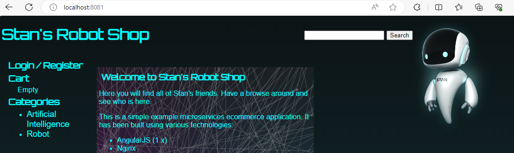

### Volumes
```
Inside pod
          contianer + volume
if pod deleted then we will lose data

solution: keep volume outside pod
Inside Node: 
            Pod
            volume
if Node deleted then we will lose data

Note: Not recommended to store data inside cluster
```
### Empty Dir
```
- Empty Dir volume 
  - Shared storage between containers in a pod
  - The emptyDir volume is initially empty and is created when a pod is assigned to a node
  - It can be used for temporary storage that is shared among containers within the same pod
  - we can attach it as directory to container (if pod deleted data lost)
  - if Container deleted then we will not lose data
  - we don't know where data will be stored
```
#### emptydir.yml
```
apiVersion: v1
kind: Pod
metadata:
  name: simple-webapp
  labels:
    app: webapp
spec:
  containers:
    - name: main-application
      image: nginx
      volumeMounts:
        - name: shared-logs
          mountPath: /var/log/nginx
    - name: sidecar-container
      image: busybox
      command: ["sh","-c","while true; do cat /var/log/nginx/access.log; sleep 30; done"]
      volumeMounts:
        - name: shared-logs
          mountPath: /var/log/nginx
  volumes:
    - name: shared-logs
      emptyDir: {}
```
```
kubectl apply -f emptydir.yml
```
```
kubectl get pods
    NAME            READY   STATUS    RESTARTS   AGE
    simple-webapp   2/2     Running   0          59s
```
### sidecar application will pick up logs from main application via Empty dir & publish to ELK, Empty dir create shared directory between container's
#### login to main-application
```
kubectl exec simple-webapp -it -c main-application -- sh 
    # cd /var/log/nginx
    # ls -l
    total 4
    -rw-r--r-- 1 root root   0 Dec 17 07:05 access.log
    -rw-r--r-- 1 root root 862 Dec 17 07:05 error.log
```
#### login to sidecar-container
```
kubectl exec simple-webapp -it -c sidecar-container -- sh  
    / #
    / # cd /var/log/nginx
    /var/log/nginx # ls -l
    total 4
    -rw-r--r--    1 root     root             0 Dec 17 07:05 access.log
    -rw-r--r--    1 root     root           862 Dec 17 07:05 error.log
    /var/log/nginx #
```
### mounting config maps as volume
```
1. create a configmap for files (nginx.conf)
2. mount them as volumes
3. use it for containers
```
#### configmap-volume.yml
```
apiVersion: v1
kind: ConfigMap
metadata:
  name: nginx-config
data:
  nginx.conf: |
    # this config is loading from nginx config map

    user nginx;
    worker_processes auto;
    pid /var/run/nginx.pid;

    error_log  /var/log/nginx/error.log notice;

    events {
      worker_connections 768;
      # multi_accept on;
    }

    http {

        include       /etc/nginx/mime.types;
        default_type  application/octet-stream;

        log_format  main  '$remote_addr $time_local $request $status $body_bytes_sent $request_time';

        access_log  /var/log/nginx/access.log  main;

        sendfile        on;
        #tcp_nopush     on;

        keepalive_timeout  65;

        #gzip  on;

        include /etc/nginx/conf.d/*.conf;

        server {
            listen       80;
            server_name  localhost;
            location / {
                root   /usr/share/nginx/html;
                index  index.html index.htm;
            }
            error_page   500 502 503 504  /50x.html;
            location = /50x.html {
                root   /usr/share/nginx/html;
            }

            proxy_http_version 1.1;
            location /images/ {
            expires 5s;
            root   /usr/share/nginx/html;
            try_files $uri /images/placeholder.jpg;
            }

            location /api/catalogue/ {
                proxy_pass http://catalogue:8080/;
            }

            location /nginx_status {
                stub_status on;
                access_log off;
            }
        }
    }
---
apiVersion: v1
kind: Pod
metadata:
  name: web
  labels:
    name: web
    tier: FE
    owner: Naveen
spec:
  volumes:
    - name: nginx-config
      configMap:
          name: nginx-config
          items:
            - key: nginx.conf
              path: nginx.conf
  containers:
  - name: web
    image: naveen2809/web:2.0.1
    resources:
      limits:
        memory: "128Mi"
        cpu: "500m"
    ports:
      - containerPort: 80
    volumeMounts:
    - name: nginx-config
      mountPath: /etc/nginx/nginx.conf
      subPath: nginx.conf
---
apiVersion: v1
kind: Service
metadata:
  name: web
spec:
  type: LoadBalancer
  selector:
    name: web
    tier: FE
    owner: Naveen
  ports:
  - port: 8081
    targetPort: 80
```
```
minikube tunnel
```
#### Note: we need to run mongodb & catalogue before run web because we added catalogue path in nginx-config
```
kubectl apply -f configmap-volume.yml
```
```
kubectl get pods        
    NAME        READY   STATUS    RESTARTS   AGE
    catalogue   1/1     Running   0          16m
    mongodb     1/1     Running   0          16m
    web         1/1     Running   0          16m
```
```
kubectl get svc 
    NAME         TYPE           CLUSTER-IP      EXTERNAL-IP   PORT(S)          AGE
    catalogue    ClusterIP      10.99.164.190   <none>        8080/TCP         16m
    mongodb      ClusterIP      10.111.192.22   <none>        27017/TCP        16m
    web          LoadBalancer   10.104.123.29   127.0.0.1     8081:31834/TCP   16m
```
```
kubectl exec -it web -- bash
  root@web:/# cat /etc/nginx/nginx.coconf | sudo
  .
  .
  location /api/catalogue/ {
            proxy_pass http://catalogue:8080/;
  }
  .
  .
  root@web:/#
```


### Side car with Elasticsearch
#### Note: ElasticSearch need to be run first (for filebeat to publish logs)
#### sidecar.yml
```
apiVersion: v1
kind: ConfigMap
metadata:
  name: filebeat-config
data:
  filebeat.yml: |-
    filebeat.inputs:
    - type: log
      enabled: true
      paths:
        - /var/log/nginx/access.log
        - /var/log/nginx/error.log

    output.elasticsearch:
      hosts: ["elasticsearch:9200"]
---
apiVersion: v1
kind: Pod
metadata:
  name: nginx-filebeat
spec:
  volumes:
    - name: filebeat-config
      configMap:
        name: filebeat-config
    - name: nginx-log
      emptyDir: {}
  containers:
    - name: nginx
      image: nginx:latest
      volumeMounts:
        - name: nginx-log
          mountPath: /var/log/nginx
    - name: filebeat
      image: docker.elastic.co/beats/filebeat:7.16.3
      volumeMounts:
        - name: filebeat-config
          mountPath: /usr/share/filebeat/filebeat.yml
          subPath: filebeat.yml
        - name: nginx-log
          mountPath: /var/log/nginx
```
```
kubectl apply -f side-car.yml
    configmap/filebeat-config configured
    pod/nginx-filebeat configured
```
```
kubectl get pods        
    NAME             READY   STATUS    RESTARTS   AGE
    nginx-filebeat   2/2     Running   0          3m56s
```
```
kubectl logs nginx-filebeat -c filebeat    
    2023-12-17T11:05:09.988Z        INFO    instance/beat.go:686    
    Home path: [/usr/share/filebeat] 
    Config path: [/usr/share/filebeat] 
    Data path: [/usr/share/filebeat/data] 
    Logs path: [/usr/share/filebeat/logs] 
    Hostfs Path: [/]

    2023-12-17T11:10:21.953Z        ERROR   [esclientleg]   transport/logging.go:37 Error dialing lookup elasticsearch on 10.96.0.10:53: 
    read udp 172.17.0.3:58152->10.96.0.10:53: i/o timeout        {"network": "tcp", "address": "elasticsearch:9200"}
```
```
kubectl exec -it nginx-filebeat -c filebeat -- bash
    bash-4.2$ cd /usr/share/filebeat/data
    bash-4.2$ ls 
    filebeat.lock  meta.json  registry
    bash-4.2$ cd /usr/share/filebeat
    bash-4.2$ ls
    LICENSE.txt  NOTICE.txt  README.md  data  fields.yml  filebeat  filebeat.reference.yml  filebeat.yml  kibana  logs  module  modules.d
```