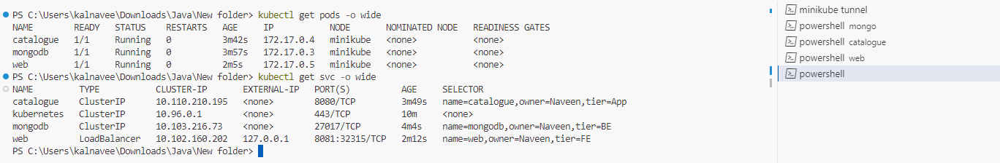
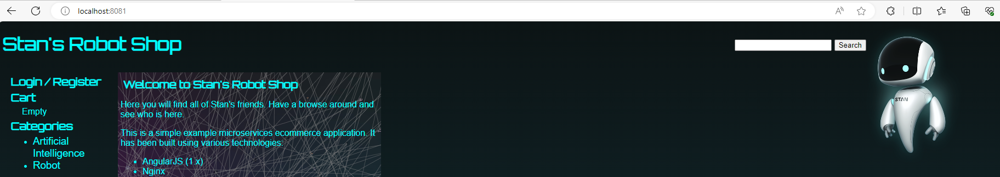

### Running Order 
```
Mongo -- Catalogue -- Web
```
### Mongo Service
#### manifest.yml
```
apiVersion: v1
kind: Pod
metadata:
  name: mongodb
  labels:
    name: mongodb
    tier: BE
    owner: Naveen
spec:
  containers:
  - name: mongodb
    imagePullPolicy: Always
    image: naveen2809/mongodb:1.0.0
    ports:
      - containerPort: 27017
---
apiVersion: v1
kind: Service
metadata:
  name: mongodb
spec:
  selector:
    name: mongodb
    tier: BE
    owner: Naveen
  ports:
  - port: 27017
    targetPort: 27017
```
```
kubectl apply -f manifest.yml
```
### Catalogue Service
#### manifest.yml
```
apiVersion: v1
kind: Pod
metadata:
  name: catalogue
  labels:
    name: catalogue
    tier: App
    owner: Naveen
spec:
  containers:
  - name: catalogue
    imagePullPolicy: Always
    image: naveen2809/catalogue:1.0.0
    ports:
      - containerPort: 8080
---
apiVersion: v1
kind: Service
metadata:
  name: catalogue
spec:
  selector:
    name: catalogue
    tier: App
    owner: Naveen
  ports:
  - port: 8080
    targetPort: 8080
```
```
kubectl apply -f manifest.yml
```
### Web Service
#### manifest.yml
```
apiVersion: v1
kind: Pod
metadata:
  name: web
  labels:
    name: web
    tier: FE
    owner: Naveen
spec:
  containers:
  - name: web
    imagePullPolicy: Always
    image: naveen2809/web:2.0.2
    ports:
      - containerPort: 80
---
apiVersion: v1
kind: Service
metadata:
  name: web
spec:
  type: LoadBalancer
  selector:
    name: web
    tier: FE
    owner: Naveen
  ports:
  - port: 8081
    targetPort: 80
```
```
kubectl apply -f manifest.yml
```
#### Start Tunneling Service
```
minikube tunnel
```
#### Pods & Services

#### HomePage

```
kubectl delete -f manifest.yml
```