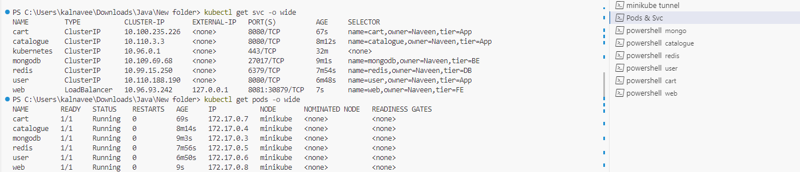
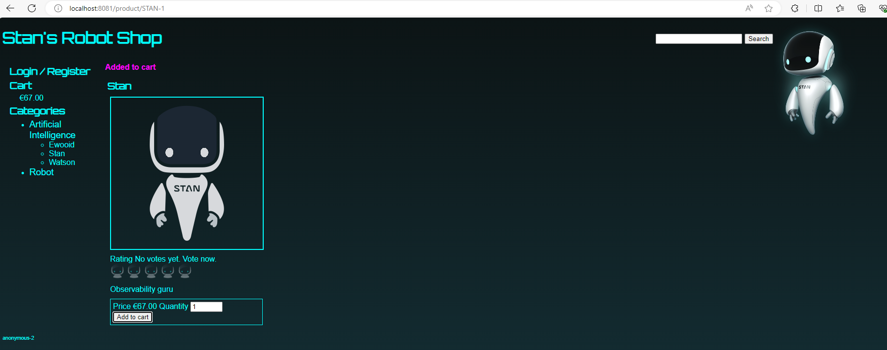
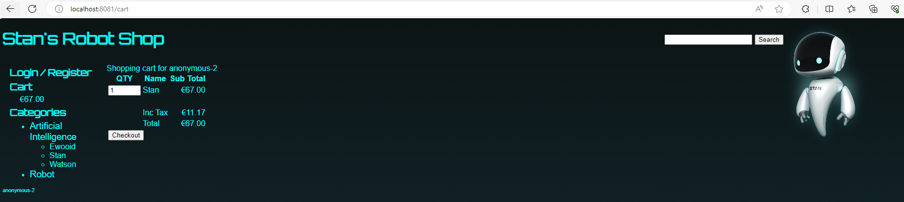

### Running Order 
```
Mongo -- Catalogue -- Web
```
### Mongo Service
#### manifest.yml
```
apiVersion: v1
kind: Pod
metadata:
  name: mongodb
  labels:
    name: mongodb
    tier: BE
    owner: Naveen
spec:
  containers:
  - name: mongodb
    imagePullPolicy: Always
    image: naveen2809/mongodb:1.0.0
    ports:
      - containerPort: 27017
---
apiVersion: v1
kind: Service
metadata:
  name: mongodb
spec:
  selector:
    name: mongodb
    tier: BE
    owner: Naveen
  ports:
  - port: 27017
    targetPort: 27017
```
```
kubectl apply -f manifest.yml
```
### Catalogue Service
#### manifest.yml
```
apiVersion: v1
kind: Pod
metadata:
  name: catalogue
  labels:
    name: catalogue
    tier: App
    owner: Naveen
spec:
  containers:
  - name: catalogue
    imagePullPolicy: Always
    image: naveen2809/catalogue:1.0.0
    ports:
      - containerPort: 8080
---
apiVersion: v1
kind: Service
metadata:
  name: catalogue
spec:
  selector:
    name: catalogue
    tier: App
    owner: Naveen
  ports:
  - port: 8080
    targetPort: 8080
```
### OR (using ConfigMap)
```
apiVersion: v1
kind: ConfigMap
metadata:
  name: catalogue-config
data:
  MONGO_URL: "mongodb://mongodb:27017/catalogue"
---
apiVersion: v1
kind: Pod
metadata:
  name: catalogue
  labels:
    name: catalogue
    tier: App
    owner: Naveen
spec:
  containers:
  - name: catalogue
    imagePullPolicy: Always
    image: naveen2809/catalogue:1.0.0
    envFrom:
      - configMapRef:
            name: catalogue-config
    ports:
      - containerPort: 8080
---
apiVersion: v1
kind: Service
metadata:
  name: catalogue
spec:
  selector:
    name: catalogue
    tier: App
    owner: Naveen
  ports:
  - port: 8080
    targetPort: 8080
```
```
kubectl apply -f manifest.yml
```
### Running Order
```
Web → User → Mongo & Redis
```
```
Note:
    Web service depends on User.
    User depends on Mongo service.
    User depends on Redis

MongoDB should run first than User
Redis should run first than User
Modify default.conf for nginx to pick User Service
Re-build Web Image
```
### Redis
#### manifest.yml
```
apiVersion: v1
kind: Pod
metadata:
  name: redis
  labels:
    name: redis
    tier: DB
    owner: Naveen
spec:
  containers:
  - name: redis
    image: redis
    ports:
      - containerPort: 6379
---
apiVersion: v1
kind: Service
metadata:
  name: redis
spec:
  selector:
    name: redis
    tier: DB
    owner: Naveen
  ports:
    - port: 6379
      targetPort: 6379
```
### User
#### manifest.yml
```
apiVersion: v1
kind: ConfigMap
metadata:
  name: user-config
data:
  MONGO_URL: mongodb://mongodb:27017/users
  REDIS_HOST: redis
---
apiVersion: v1
kind: Pod
metadata:
  name: user
  labels:
    name: user
    tier: App
    owner: Naveen
spec:
  containers:
  - name: user
    image: naveen2809/user:1.0.0
    envFrom:
      - configMapRef:
            name: user-config
    ports:
      - containerPort: 8080
---
apiVersion: v1
kind: Service
metadata:
  name: user
spec:
  selector:
    name: user
    tier: App
    owner: Naveen
  ports:
  - port: 8080
    targetPort: 8080
```
### Cart
```
Web → Cart → catalogue & redis
Note:
    cart depends on catalogue & redis

redis should run first than Cart
```
#### manifest.yml
```
apiVersion: v1
kind: ConfigMap
metadata:
  name: cart-config
data:
  REDIS_HOST: "redis"
  CATALOGUE_HOST: "catalogue"
---
apiVersion: v1
kind: Pod
metadata:
  name: cart
  labels:
    name: cart
    tier: App
    owner: Naveen
spec:
  containers:
  - name: cart
    image: naveen2809/cart:1.0.0
    imagePullPolicy: Always
    envFrom:
      - configMapRef:
            name: cart-config
    ports:
      - containerPort: 8080
---
apiVersion: v1
kind: Service
metadata:
  name: cart
spec:
  selector:
    name: cart
    tier: App
    owner: Naveen
  ports:
  - port: 8080
    targetPort: 8080
```
### Web Service
#### manifest.yml
```
apiVersion: v1
kind: Pod
metadata:
  name: web
  labels:
    name: web
    tier: FE
    owner: Naveen
spec:
  containers:
  - name: web
    imagePullPolicy: Always
    image: naveen2809/web:2.0.4
    ports:
      - containerPort: 80
---
apiVersion: v1
kind: Service
metadata:
  name: web
spec:
  type: LoadBalancer
  selector:
    name: web
    tier: FE
    owner: Naveen
  ports:
  - port: 8081
    targetPort: 80
```
```
kubectl apply -f manifest.yml
```
#### Start Tunneling Service
```
minikube tunnel
```
#### Pods & Services

#### HomePage


```
kubectl delete -f manifest.yml
```