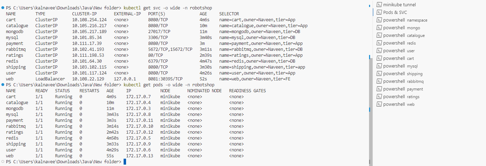
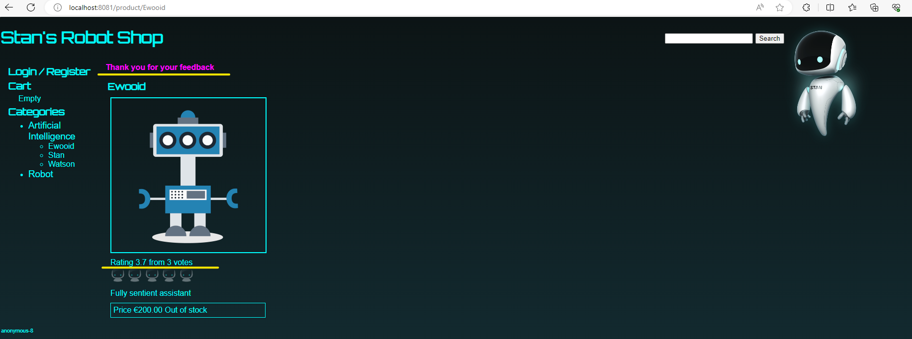
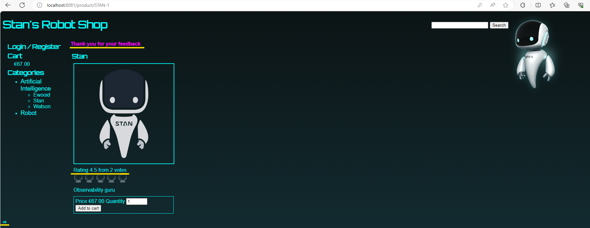

#### manifest.yml
```
apiVersion: v1
kind: Namespace
metadata:
  name: robotshop
```
### Running Order 
```
Mongo -- Catalogue -- Web
```
### Mongo Service
#### manifest.yml
```
apiVersion: v1
kind: Pod
metadata:
  name: mongodb
  namespace: robotshop
  labels:
    name: mongodb
    tier: DB
    owner: Naveen
spec:
  containers:
  - name: mongodb
    imagePullPolicy: Always
    image: naveen2809/mongodb:1.0.0
    ports:
      - containerPort: 27017
---
apiVersion: v1
kind: Service
metadata:
  name: mongodb
  namespace: robotshop
spec:
  selector:
    name: mongodb
    tier: DB
    owner: Naveen
  ports:
  - port: 27017
    targetPort: 27017
```
```
kubectl apply -f manifest.yml
```
### Catalogue Service
#### manifest.yml
```
apiVersion: v1
kind: Pod
metadata:
  name: catalogue
  namespace: robotshop
  labels:
    name: catalogue
    tier: App
    owner: Naveen
spec:
  containers:
  - name: catalogue
    imagePullPolicy: Always
    image: naveen2809/catalogue:1.0.0
    ports:
      - containerPort: 8080
---
apiVersion: v1
kind: Service
metadata:
  name: catalogue
  namespace: robotshop
spec:
  selector:
    name: catalogue
    tier: App
    owner: Naveen
  ports:
  - port: 8080
    targetPort: 8080
```
### OR (using ConfigMap)
```
apiVersion: v1
kind: ConfigMap
metadata:
  name: catalogue-config
  namespace: robotshop
data:
  MONGO_URL: mongodb://mongodb:27017/catalogue
---
apiVersion: v1
kind: Pod
metadata:
  name: catalogue
  namespace: robotshop
  labels:
    name: catalogue
    tier: App
    owner: Naveen
spec:
  containers:
  - name: catalogue
    imagePullPolicy: Always
    image: naveen2809/catalogue:1.0.0
    envFrom:
      - configMapRef:
            name: catalogue-config
    ports:
      - containerPort: 8080
---
apiVersion: v1
kind: Service
metadata:
  name: catalogue
  namespace: robotshop
spec:
  selector:
    name: catalogue
    tier: App
    owner: Naveen
  ports:
  - port: 8080
    targetPort: 8080
```
```
kubectl apply -f manifest.yml
```
### Running Order
```
Web → User → Mongo & Redis
```
```
Note:
    Web service depends on User.
    User depends on Mongo service.
    User depends on Redis

MongoDB should run first than User
Redis should run first than User
Modify default.conf for nginx to pick User Service
Re-build Web Image
```
### Redis
#### manifest.yml
```
apiVersion: v1
kind: Pod
metadata:
  name: redis
  namespace: robotshop
  labels:
    name: redis
    tier: DB
    owner: Naveen
spec:
  containers:
  - name: redis
    image: redis
    ports:
      - containerPort: 6379
---
apiVersion: v1
kind: Service
metadata:
  name: redis
  namespace: robotshop
spec:
  selector:
    name: redis
    tier: DB
    owner: Naveen
  ports:
    - port: 6379
      targetPort: 6379
```
### User
#### manifest.yml
```
apiVersion: v1
kind: ConfigMap
metadata:
  name: user-config
  namespace: robotshop
data:
  MONGO_URL: mongodb://mongodb:27017/users
  REDIS_HOST: redis
---
apiVersion: v1
kind: Pod
metadata:
  name: user
  namespace: robotshop
  labels:
    name: user
    tier: App
    owner: Naveen
spec:
  containers:
  - name: user
    imagePullPolicy: Always
    image: naveen2809/user:1.0.0
    envFrom:
      - configMapRef:
            name: user-config
    ports:
      - containerPort: 8080
---
apiVersion: v1
kind: Service
metadata:
  name: user
  namespace: robotshop
spec:
  selector:
    name: user
    tier: App
    owner: Naveen
  ports:
  - port: 8080
    targetPort: 8080
```
### Cart
```
Web → Cart → catalogue & redis
Note:
    cart depends on catalogue & redis

redis should run first than Cart
```
#### manifest.yml
```
apiVersion: v1
kind: ConfigMap
metadata:
  name: cart-config
  namespace: robotshop
data:
  REDIS_HOST: redis
  CATALOGUE_HOST: catalogue
---
apiVersion: v1
kind: Pod
metadata:
  name: cart
  namespace: robotshop
  labels:
    name: cart
    tier: App
    owner: Naveen
spec:
  containers:
  - name: cart
    image: naveen2809/cart:1.0.0
    imagePullPolicy: Always
    envFrom:
      - configMapRef:
            name: cart-config
    ports:
      - containerPort: 8080
---
apiVersion: v1
kind: Service
metadata:
  name: cart
  namespace: robotshop
spec:
  selector:
    name: cart
    tier: App
    owner: Naveen
  ports:
  - port: 8080
    targetPort: 8080
```
### Shipping
```
Web → Shipping → mysql
Note:
    mysql depends on shipping

Copy Shipping & mysql.
mysql should run first than shipping.
```
### mysql
```
apiVersion: v1
kind: ConfigMap
metadata:
  name: mysql-config
  namespace: robotshop
data:
  MYSQL_ALLOW_EMPTY_PASSWORD: "yes"
  MYSQL_DATABASE: "cities" 
---
apiVersion: v1
kind: Secret
metadata:
  name: mysql-secret
  namespace: robotshop
type: Opaque
data:
  MYSQL_USER: c2hpcHBpbmc=
  MYSQL_PASSWORD: c2VjcmV0
---
# Don't limit resourcces for Databases
apiVersion: v1
kind: Pod
metadata:
  name: mysql
  namespace: robotshop
  labels:
    name: mysql
    tier: DB
    owner: Naveen
spec:
  containers:
  - name: mysql
    imagePullPolicy: Always
    image: naveen2809/mysql:2.0.0
    envFrom:
      - configMapRef:
            name: mysql-config
      - secretRef:
            name: mysql-secret
    ports:
      - containerPort: 3306
---
apiVersion: v1
kind: Service
metadata:
  name: mysql
  namespace: robotshop
spec:
  selector:
    name: mysql
    tier: DB
    owner: Naveen
  ports:
  - port: 3306
    targetPort: 3306
```
### shipping
#### manifest.yml
```
apiVersion: v1
kind: ConfigMap
metadata:
  name: shipping-config
  namespace: robotshop
data:
  CART_ENDPOINT: cart:8080
  DB_HOST: mysql
---
apiVersion: v1
kind: Pod
metadata:
  name: shipping
  namespace: robotshop
  labels:
    name: shipping
    tier: app
    owner: Naveen
spec:
  containers:
  - name: shipping
    imagePullPolicy: Always
    image: naveen2809/shipping:2.0.0
    envFrom:
    - configMapRef:
        name: shipping-config
    ports:
      - containerPort: 8080
---
apiVersion: v1
kind: Service
metadata:
  name: shipping
  namespace: robotshop
spec:
  selector:
    name: shipping
    tier: app
    owner: Naveen
  ports:
    - protocol: TCP
      port: 8080
      targetPort: 8080
```
## Paymet
```
Web → Payment → RabbitMq
Note:
    Payments depends on RabbitMq

RabbitMq should run first than Payments
```
### rabbitmq
#### manifest.yml
```
apiVersion: v1
kind: Pod
metadata:
  name: rabbitmq
  namespace: robotshop
  labels:
    name: rabbitmq
    tier: DB
    owner: Naveen
spec:
  containers:
  - name: rabbitmq
    image: rabbitmq
    imagePullPolicy: Always
    ports:
      - containerPort: 5672
      - containerPort: 15672
---
apiVersion: v1
kind: Service
metadata:
  name: rabbitmq
  namespace: robotshop
spec:
  selector:
    name: rabbitmq
    tier: DB
    owner: Naveen
  ports:
  - port: 5672
    name: amqp
  - port: 15672
    name: http
```
### Payment
#### manifest.yml
```
apiVersion: v1
kind: ConfigMap
metadata:
  namespace: robotshop
  name: payment-config
data:
  CART_HOST: cart
  USER_HOST: user
  AMQP_HOST: rabbitmq
---
apiVersion: v1
kind: Pod
metadata:
  name: payment
  namespace: robotshop
  labels:
    name: payment
    tier: App
    owner: Naveen
spec:
  containers:
  - name: payment
    image: naveen2809/payment:1.0.0
    imagePullPolicy: Always
    envFrom:
      - configMapRef:
            name: payment-config
    ports:
      - containerPort: 8080
---
apiVersion: v1
kind: Service
metadata:
  name: payment
  namespace: robotshop
spec:
  selector:
    name: payment
    tier: App
    owner: Naveen
  ports:
  - protocol: TCP
    port: 8080
    targetPort: 8080
```
### Ratings
```
Web → Ratings → MySql
Note:
    Ratings depends on MySql

MySql run first than Ratings
```
#### manifest.yml
```
apiVersion: v1
kind: Pod
metadata:
  name: ratings
  labels:
    name: ratings
    tier: App
    owner: Naveen
spec:
  containers:
  - name: ratings
    image: naveen2809/ratings:1.0
    resources:
      limits:
        memory: "128Mi"
        cpu: "500m"
    ports:
      - containerPort: 80
---
apiVersion: v1
kind: Service
metadata:
  name: ratings
spec:
  selector:
    name: ratings
    tier: App
    owner: Naveen
  ports:
  - port: 80
    targetPort: 80
```
### web
#### manifest.yml
```
apiVersion: v1
kind: Pod
metadata:
  name: web
  labels:
    name: web
    tier: FE
    owner: Naveen
spec:
  containers:
  - name: web
    # imagePullPolicy: Always
    image: naveen2809/web:2.0.7
    ports:
      - containerPort: 80
---
apiVersion: v1
kind: Service
metadata:
  name: web
spec:
  type: LoadBalancer
  selector:
    name: web
    tier: FE
    owner: Naveen
  ports:
  - port: 8081
    targetPort: 80
```
```
Build & Push to Docker Hub
docker build -t naveen2809/web:2.0.7 .
docker push naveen2809/web:2.0.7

Run the service
kubectl apply -f manifest.yml
```
#### Start Tunneling Service
```
minikube tunnel
```
#### Pods & Services

#### HomePage


```
kubectl delete -f manifest.yml
```