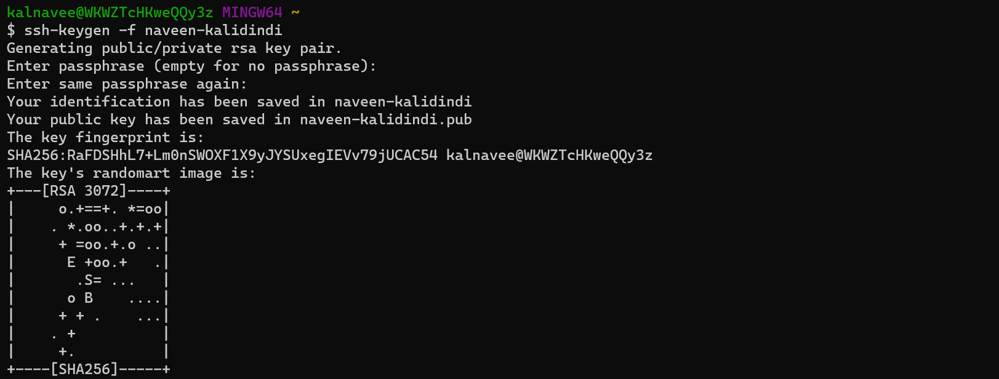
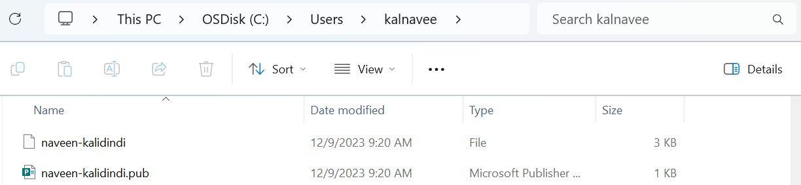

### computer
```
OS + RAM + Storage + CPU && It Should has IP address

Based on purpose we call them with different names
_> Mobile __> Calling
_> Laptop __> Internet,Browsing,Watching Movies
_> Server __> Install Applications & Serve User's Request's
```
```
Windows have graphics = Consume More Memory, CPU, RAM
Linux don't have graphics = Consume Less Memory,CPU, RAM

Why OS??
OS is bridge between user & Hardware
kernel + shell = Linux

User -- commands -- 0/1 -- Hardware
Application -- shell -- kernal -- Hardware

Kernel – Heart of OS, interacts with Hardware
Shell – takes inputs from user & pass to kernel

UNIX → Not portable (tightly coupled with hardware), costly, but secure
LINUX → portable, secure (based on UNIX principles), written in c language
kernel + shell = Linux
```
```
why Linux??
  → open source
  → Less cost
  → More performance
  → Highly Stable
  → Low power

More utilities → Ubuntu, Fedora, Centos
kernel + Shell + graphics = Android, Ubuntu Desktop
kernel + Shell + some utilities = server

RHEL – License + Support
CentOS – Free + community support
Amazon Linux – Free + community support

Ubuntu – Free + community support

→ *** ← APT  (Debian/Ubuntu)
→ *** ← YUM  (Fedora/RHEL/Amazon Linux/CentOS)
```
### Ways to Connect to Linux Server 
```
→ What you know →→ username/password
→ What you have →→ token
→ what you are →→ fingerprint, palms,retina etc..
```
### we use token to Connect to Linux Server's
```
public key →→→ server
private key →→→ client

we can generate key??
ssh-keygen -f <file-name>
ex: ssh-keygen -f naveen-kalidindi

it will generate 2 files
naveen-kalidindi →→ private key
naveen-kalidindi.pub →→ public key
```


### Import Key-Pair
```
EC2 Dashboard -- Key-Pair -- Import Key-Pair -- copy plaste public key -- save
```
### Login into EC2 Server
```
ssh -i naveen-kalidindi.pem ec2-user@xx.xx.xx.xx
```
```
$ -- Normal user
# -- Root user

Normal user to Root user
sudo su - 
sudo -i 

pwd -- present working directory
cd -- change directory
history -- show command history
```
### List Command
```
ls        -- list files
ls -l     -- a-z order
ls -lt    -- recently accessed files at top
ls -lr    -- z-a order
ls -lrt   -- recently accessed files at last
ls -la    -- show hidden files
```
### CRUD commands
```
create a new file
  touch f1.txt
  touch f2.txt
  ls -l
  f1.txt f2.txt

create a new folder
  mkdir devops
  ls -l
  f1.txt f2.txt devops

Add data to file
  cat > f1.txt // (modify content everytime) open f1.txt, enter ctr+d to save
  cat >> f1.txt // Append content to file

remove file
  rm f1.txt

remove folder
  rm -rf devops  // -r recursively, -f forceful 
  --OR--
  rm -r devops
  --OR--
  rmdir devops // remove only if directory is empty
```
### Copy folder's
```
sh-5.2# pwd
/
sh-5.2# mkdir devops
sh-5.2# ls
afs  bin  boot  dev  devops  etc  home  lib  lib64  lost+found  media  mnt  opt  proc  root  run  sbin  srv  sys  tmp  usr  var
sh-5.2# cd dev
dev/    devops/ 
sh-5.2# cd devops 
sh-5.2# ls
sh-5.2# mkdir dev1
sh-5.2# cd dev1/
sh-5.2# touch f1.txt
sh-5.2# cat > f1.txt
Hii This is From F1.txt file
sh-5.2# cat f1.txt
Hii This is From F1.txt file
sh-5.2# cd ../..
sh-5.2# pwd
/
sh-5.2# cp -r devops /opt
sh-5.2# cd /opt
sh-5.2# ls
devops
sh-5.2# cd devops/
sh-5.2# ls
dev1
sh-5.2# cd dev1/
sh-5.2# ls
f1.txt
```
### Move/Copy folder's
```
sh-5.2# cd /
sh-5.2# ls
afs  bin  boot  dev  devops  etc  home  lib  lib64  lost+found  media  mnt  opt  proc  root  run  sbin  srv  sys  tmp  usr  var
sh-5.2# mv devops /opt
sh-5.2# ls
afs  bin  boot  dev  etc  home  lib  lib64  lost+found  media  mnt  opt  proc  root  run  sbin  srv  sys  tmp  usr  var
sh-5.2# cd /opt
sh-5.2# ls
devops
sh-5.2# cd devops/
sh-5.2# ls
dev1
sh-5.2# cd dev1/
sh-5.2# ls
f1.txt
```

### Rename folder
```
sh-5.2# pwd
/opt/devops
sh-5.2# ls
dev1
sh-5.2# mv dev1 dev2
sh-5.2# ls
dev2
```
### head & tail
```
head f1.txt // first 10 lines
head f1.txt -n 2 // first 2 lines
tail f2.txt // last 10 lines
tail f2.txt -n 2 // last 2 lines

less f2.txt // show entire file
shift + g →→ go down
gg →→ go up
q →→ quit
```
### Search in file??
Note: Linux is by default case sensitive
```
grep root /etc/passwd

grep -i root /etc/passwd    //ignore case sensitive

cat /etc/passwd | grep root  //we are using piping (o/p stage given as i/p to next stage)
```
### curl vs wget
```
wget -- download files
curl -- download text content directly to terminal
we can use curl as wget
Ex: curl -o /tmp/web.zip https://roboshop-builds.s3.amazonaws.com/web.zip
```
### cut vs awk
```
http://localhost:8080/login?from=%2F

delimiter
: -- http,//localhost,8080/login?from=%2F
/ -- http:,,localhost:8080,login?from=%2F

cut
---
sh-5.2# echo http://localhost:8080/login?from=%2F | cut -d : -f1
http
sh-5.2# echo http://localhost:8080/login?from=%2F | cut -d : -f2
//localhost
```
### awk
#### Note:: we can cut column wise too with awk command
```
sh-5.2# echo http://localhost:8080/login?from=%2F | awk -F / '{print $1F}'
http:
sh-5.2# echo http://localhost:8080/login?from=%2F | awk -F / '{print $2F}'

sh-5.2# echo http://localhost:8080/login?from=%2F | awk -F / '{print $NF}'
login?from=%2F

sh-5.2# cat /etc/passwd
root:x:0:0:Super User:/root:/bin/bash
bin:x:1:1:bin:/bin:/usr/sbin/nologin
daemon:x:2:2:daemon:/sbin:/usr/sbin/nologin
adm:x:3:4:adm:/var/adm:/usr/sbin/nologin
lp:x:4:7:lp:/var/spool/lpd:/usr/sbin/nologin
sync:x:5:0:sync:/sbin:/bin/sync
shutdown:x:6:0:shutdown:/sbin:/sbin/shutdown
halt:x:7:0:halt:/sbin:/sbin/halt
mail:x:8:12:mail:/var/spool/mail:/usr/sbin/nologin
operator:x:11:0:operator:/root:/usr/sbin/nologin
games:x:12:100:games:/usr/games:/usr/sbin/nologin
ftp:x:14:50:FTP User:/var/ftp:/usr/sbin/nologin
nobody:x:65534:65534:Kernel Overflow User:/:/usr/sbin/nologin
tss:x:59:59:Account used for TPM access:/:/usr/sbin/nologin

sh-5.2# cat /etc/passwd | awk -F : '{print $1F}'
root
bin
daemon
adm
lp
sync
shutdown
halt
mail
operator
games
ftp
nobody
tss

sh-5.2# cat /etc/passwd | awk -F : '{print $NF}'
/bin/bash
/usr/sbin/nologin
/usr/sbin/nologin
/usr/sbin/nologin
/usr/sbin/nologin
/bin/sync
/sbin/shutdown
/sbin/halt
/usr/sbin/nologin
/usr/sbin/nologin
/usr/sbin/nologin
/usr/sbin/nologin
/usr/sbin/nologin
/usr/sbin/nologin
```

### vi editor commands
```
shift+g -- go to end of file
gg -- go to beginning of file
u -- undo changes in file
yy -- copy
p -- paste
10p -- paste 10 times
50p -- paste 50 times

search the content/word
-----------------------
:/<word-to-search> -- search from top

I want to search for word "talk"
:/talk (press enter then press n to got to next matched line)

:?<word-to-search> -- search from bottom

replace the content/word
------------------------
:s/<word-to-find>/<word-to-replace> →→ replace the word where your cursor is, this will replace only first occurence in that line

:2s/<word-to-find>/<word-to-replace> // 2nd line content will modify(if word not there then error)
:%s/<word-to-find>/<word-to-replace>/g →→ all occurences
```